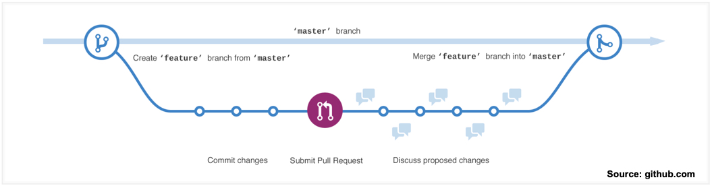
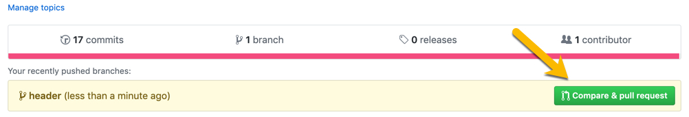
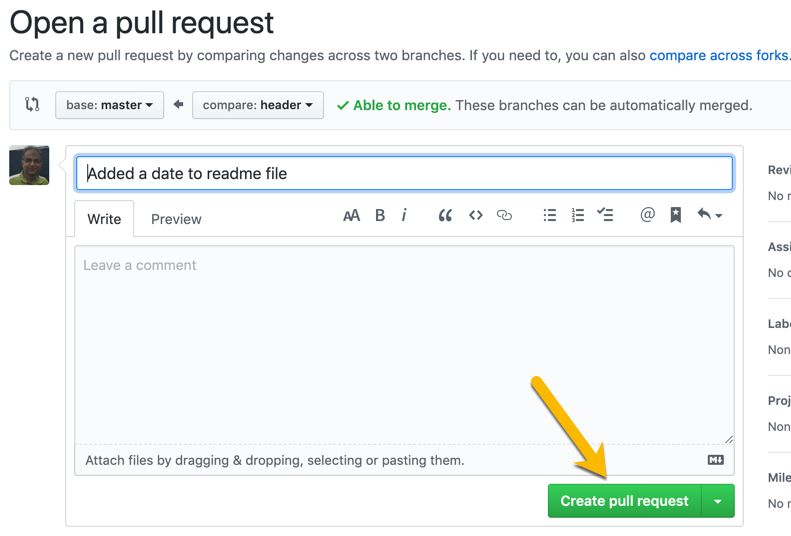
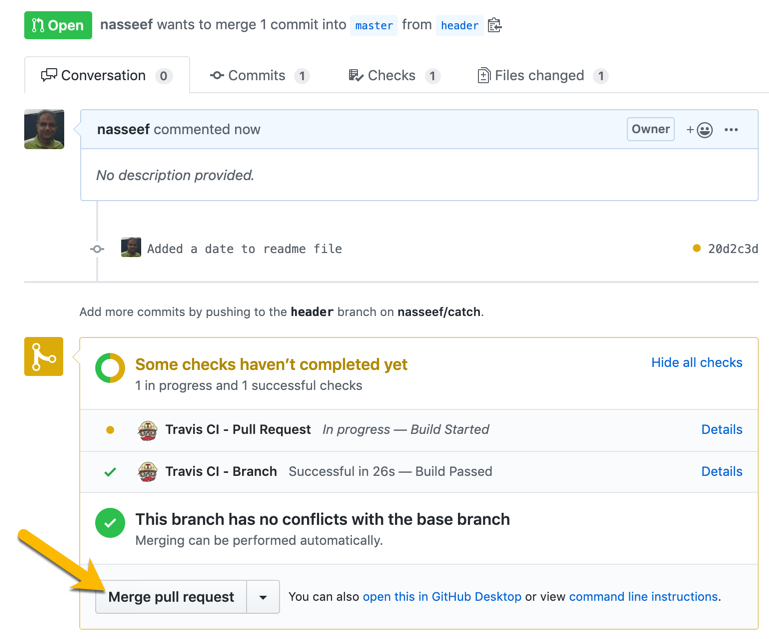

 # CS 2401 Git/GitHub Lab
 ### Prepared by: Nasseef Abukamail (abukamai@ohio.edu)
 #### November 2019

----

**You must complete the [first lab](https://github.com/2400/git-lab) prior to attempting this one. If you don't have a GitHub account, visit [GitHub for Students](https://education.github.com/students) to sign up. Make sure you use your school email to get the student's benefits.**

----

## Credentials

Make sure you configure your user name and email in `git`. Your credentials will be used in `git` history. Verify your user name and email by issuing the command `git config --list`. If your name and email are not shown in the list, execute the following commands to configure them.

```console
git config --global user.name "Enter your name here"
git config --global user.email "Enter your school email here"
```

----


## Conflicts

In the previous lab, we discussed editing the same file online and in your local repository which simulated having two people editing the same file.  Conflicts occur when two developers edit the same content (same lines of code in the same file).

From this point on, you will be working with a partner. Both of you will be working on the same repository. You will be referred to as `first` and `second` team member.

__Both team members__:

You will be working on files in the same repository to practice resolving conflicts. You will be createing a `die class` project that includes a class header, a class implementation, a driver, and a Makefile. The `Die` class will simulates an `n-sided` die.

1. `first`: Create a repository on GitHub called `die-class` with a `README.md` and a `.gitignore` file for C++.
   > A `.gitignore` file lists all the files that you don't want to include in a repository. For example, the executable file `a.out`.
2. Add `second` team member as a collaborator. You will need their GitHub user name. Click on the repository `Settings > Collaborators`.
3. Both team members: Clone `die-class` repository on your system. You will be recording your answers in `first-answers.md` and `second-answers.md`.
   
4. `first`: Create your answers file `first-answers.md`, add, and commit it.
5. `second`: Create your answers file `second-answers.md`, add, and commit it.
6. `first`: Erase the content of the `README.md` file and add the following lines at the top of the file (lines 1 and 2):
   ```
   # Git Lab #2
   ## First team member: <Enter your name here>
   ```
7. `first`: Add, commit, and push your changes to GitHub.
   
8. `second`: Make sure `first` is done with the previous step. Erase the content of the `README.md` file and add the following lines at the top of the file (lines 1 and 2):
   ```
   # The second Git Lab
   ## Second team member: <Enter your name here>
   ```
9.  `second`: Add, commit, and push your changes to GitHub. Record the error as your `Answer to Qustion 1`.
Git is telling you the online version is different from the local version of the repository. You need to `pull` the changes to your local repositories.
10. `second:` Issue the command: `git pull`. Was there a conflict reported? Copy the output of the command as your `Answer to question 2`. You just experienced a conflict. A conflict happens when both collaborators edit the same lines in the code.

11. `second`: Open the `README.md` file in your favorite editor. You should see something similar to the following:
   ```markdown
   <<<<<<< HEAD
   <your changes here>
   =======
   <your partner's changes here>
   >>>>>>> a10ec650cc73b85f41e37559df7fc6cb3affcac6
   ```
   Git separates your changes (between `<<<<<<< HEAD` and `=======`) from your teammate's changes (between `=======` and `>>>>>>>`). You job at this point is resolve this conflict by editing the file and make the appropriate changes. Modify the text to the following:
   ```
   # The second git lab
   ## First team member: first name
   ## Second team member: second name
   This repository is an example of a C++ project.
   ```

   Add, commit, and push your changes.

13. `first`: Make sure `second` is done with the previous step then edit the `README.md` file by adding the following line (line 4) to `README.md`:
     ```markdown
    Die class project. It simulates a die and includes a driver program.
    ```
    Add, commit, and push your changes to GitHub. Record the error as your `Answer to Qustion 1`.
14. `first`: Git is telling you the online version is different from the local version of the repository. You need to `pull` the changes to your local repositories.
15. `first`: Issue the command: `git pull`
16. `first`: Issue the `git push` command again. Was there a conflict reported? Copy the output of the command as your `Answer to question 2`. You just experienced a conflict. A conflict happens when both collaborators edit the same lines in the code.
17. `first`: Open the `README.md` file. You should see something similar to the following:
   ```markdown
   <<<<<<< HEAD
   <Your changes here>
   =======
   <your partner's changes here>
   >>>>>>> a10ec650cc73b85f41e37559df7fc6cb3affcac6
   ```
   Git separates your changes (between `<<<<<<< HEAD` and `=======`) from your teammate's changes(between `=======` and `>>>>>>>`). You job at this point is resolve this conflict by editing the file and make the appropriate changes. Modify the text to the following:
   ```
   # The second Git lab
   ## First team member: first name
   ## Second team member: second name
   ### Die Project: simulates the rolling of a die with a specified number of sides.
   ```
18. Add, commit, and push your changes to GitHub.
19. `second`: Make sure `first` is done with the previous command and `git pull` the changes to your local repository.
    
__At this point both teammates should have the same content on on their local repositories and on GitHub. Check the repositories contents before proceeding the next step.__

----
## Undoing Changes (Files/Commits)

Each team member will complete the following section independently.

One of the most important features of git is its ability to recover older versions of files or repositories. Git keeps track of the repository history through its commits. Each commit is identified by a unique hexadecimal id/hash number (example: `e72f52ae4336d16d1affef8a0dc5162039022db2`). To see all commit history, execute the command `git log`. You should see something similar to the following:

```console
commit e72f52ae4336d16d1affef8a0dc5162039022db2 (HEAD -> master, origin/master)
Author: Nasseef Abukamail <abukamai@ohio.edu>
Date:   Sat Nov 9 11:23:58 2019 -0500

    added save function

commit 3102d1072568e9a4648c51c762ff7cba3e9b3f9a
Author: Nasseef Abukamail <abukamai@ohio.edu>
Date:   Fri Nov 8 21:35:44 2019 -0500

    All options work but does not save data

commit 71a215c6be3feee130c30341fc0c8d193b54bb74
Author: Nasseef Abukamail <abukamai@ohio.edu>
Date:   Fri Nov 8 21:35:16 2019 -0500

    added a sample input file
```

The id is generally used to revert your repository to a previous state. Additionally, they can be used to recover a single file instead. Let's try some of these commands.


#### Revert to a Previous Commit

- Add another file to your repository and add some text to it and save it.
- Issue the `ls` command to make sure your file is listed.
- Add and commit your changes
- Issue the `git log`. You should see your commits (latest on top)
- Let's say you changed your mind and you want to revert to the previous commit
  - Copy the id of the second commit in the list and use it in the following command. You can just copy the first 7-8 characters.
    ```console
    git reset <id>
    ```
    Undo the commit and keep the changes. The following command will undo the commit and remove the changes:
    ```console
    git reset --hard <id>
    ```
- Issue the `git log` again and the previous commit should no longer be present.

#### Undo Changes to a Single File

- Edit the `README.md` file and add a couple of lines text. 
- Add and commit your changes
- Reset the file to a previous version:
  ```console
  git checkout -- README.md
  ```
  > Restore from the last commit

  ```console
  git checkout <id> -- README.md 
  ```

- Verify that the file has been restored.

---- 

## Branching & Pull Requests

When both team members have finished the above section, you may begin this section.

The main repository is called the `master` branch. When working with teams, you want to avoid working directly on the master branch. It is desireable to work on a copy of the repository and later merge it with the master branch. First, you will work on your repository using a separate branch and merge it with the master. Second, we you will work on a separate branch and have your teammate review your changes before merging (`pull request`).

### Branching
Branching is the process of copying the `master` branch of a repository into another branch with a different name. Braching allows you to work on the project without affecting the `master` branch. You can, later, merge your changes to the `master` branch.

**The following steps must be done by `first`**

1. List current branches by issuing the command `git branch` (you can exit this view by pressing `q`). Record the results as your `Answer to question 3`
2. Create a new branch and make it the current branch.
   ```console
   git branch header
   git checkout header
   ```
   Or create a new branch and switch to it using the single command:
   ```console
   git checkout -b header
   ```
3. List current branches
   ```console
   git branch
   ```
   Record the command output of `git branch` as your `Answer to question 4`
   > Note: current branch is marked with __`*`__

4. Now you are working with branch `header`. Add a file called `die.h` with the following content, and save it.
   ```cpp
   #ifndef DIE_H
   #define DIE_H
   #include <iostream>
   #include <fstream>
   using namespace std;

   class Die {
   public:
       /**
        * Die constructor:
        * Seed the random number generator, set the number of sides
        * to 6, and assign a random value (1-numSides) to faceValue
        */
       Die();

       /**
        * Die constructor:
        * Seed the random number generator, set the number of sides
        * to newNumSides, and assign a random value (1-numSides) to faceValue
        */
       Die(int newNumSides);

       /**
        * getFaceValue
        * @return the face value of the die
        */
       int getFaceValue();

       /**
        * getNumSides
        * @return the number of sides of the die
        */
       int getNumSides();

       /**
        * setNumSides: change the number of the die sides and ignore it if invalid
        * @param newNumSides
        */
       void setNumSides(int newNumSides);

       /**
        * roll: assign a new random value to the die face
        * @return the face value assigned
        */
       int roll();

       /**
        * operator <<, overloads the insertion operator to print
        * the face value of the die.
        * @return the stream used
        */
       friend ostream& operator <<(ostream &out, const Die &d);
   private:
       int faceValue; ///the face value of the die
       int numSides;  ///number of faces of the die
   };

   #endif
   ```
5. Add and commit the new file
6. Issue the `ls` command and record all file names as your `Answer to question 5`.
7. Switch back to the `master` branch:
   ```console
   git checkout master
   ```
8. Issue the `ls` command again and record all file names as your `Answer to question 6`.
9.  Is your header file in the `master` branch? Record your `Answer to question 7`
10. Let's merge the changes we made in the `header` branch into the `master` branch. First make sure you are in the master branch before merging.
```console
git checkout master
git merge header
```
11. Issue the `ls` command again. You should see `die.h` file in the repository directory.
12. Push your changes to `GitHub`

**The following steps must be done by `second`**

Repeat the __Branching__ steps above `1-12`. Name your branch `implement` and add the file `die.cc` with the following content:
```cpp
#include <iostream>
#include <fstream>
#include <cstdlib>
#include "die.h"
using namespace std;

//Constructors
Die::Die(){ //default 6 sides
    numSides = 6;
    srand(time(NULL));
    faceValue = rand() % numSides + 1;

}

Die::Die(int newNumSides){
    if (newNumSides > 1) {
        numSides = newNumSides;

    }
    else {
        numSides = 6;
    }
    srand(time(NULL));
    faceValue = rand() % numSides + 1;
}

//setters
void Die::setNumSides(int newNumSides){
    if (newNumSides > 1) {
        numSides = newNumSides;
    }
}

//getters
int Die::getFaceValue(){
    return faceValue;
}
int Die::getNumSides(){
    return numSides;
}

//helper functions
int Die::roll(){
    faceValue = rand() % numSides + 1;
    return faceValue;
}

ostream& operator <<(ostream &out, const Die &d){
    out << d.faceValue;
    return out;
}
```

__Both teammates__: Make sure you have no conflicts and both of your changes are posted on GitHub. All local and online repositories should be synched at this point.

The above workflow does not work when your teammate's input is required to approve the changes. In other words, this workflow works best if you don't have a partner.

In the next section, we will addres another workflow where each partner has to approve and comment on changes made to the repository. This a more realistic approach to team work. We will do this using __pull requests__.

----

### Pull Requests

In this workflow, each team member will modify the code (using a separate branch) and ask the other team member to review it and merge it to the `master` branch. The process works by first creating a new branch, adding/modifying the code, uploading the branch to GitHub, and creating a `pull request`. A `pull request` is our way of saying: we made modifications that should be added to the software and would like the code to be pulled into the master branch. A `pull request` is then reviewed, discussed, and either rejected or merged into the `master` branch. It is a bad idea to merge your own pull requests. Always, have someone else review it and merge it.

This is a common workflow for teams working on the same repository.

You can find more information about GitHub workflow [here](https://guides.github.com/introduction/flow/).

`first`:
1. Open a terminal window and move to your repository directory on your machine. Create a new branch and name it `driver`. You will create a driver program called `die-main.cc`. 
2. Make sure that you are editing the `driver` branch by issuing the command `git branch`
3. Add the following lines of code inside `die-main.cc`:
```cpp
/*
 *      Author: <enter your name>
 *        Date: <enter the date>
 * Description: Add Description
 */
#include <iostream>
#include <iomanip>
#include <cstdlib>
#include "die.h"
using namespace std;
//function prototypes

int main() {

    Die d;
    cout << "Face value: "<< d << endl;
    Die d12(12);
    cout << "Face value: "<< d12 << endl;
    d12.setNumSides(24);
    for (size_t i = 0; i < 6; i++) {
        cout << "Roll: " << d12.roll() << endl;
    }
    return 0;
}
```

Add your name, date, and a brief description at the top of the program.

4. Add and commit your changes. You should have a new branch with the new file added.
5. Push your branch to GitHub. Try the command `git push` first. You should see a corrected command in the error message. This recommended command is required the first time you push a new branch.
6. Go to GitHub and create a pull request for your branch. Leave a comment to your partner to review it, comment on it, and merge it to the `master` branch.
   

----

   

----

   

7. Do not delete the branch when you're done.

`second`:
 Open a terminal window and cd to your repository on your machine. Create a new branch and name it `makef`. You will create a file called `Makefile`. 
1. Issue the command `git pull` to make sure you have the latest branch of the repository.
   
2. Make sure you are editing the `makef` branch by issuing the command `git branch`.
   
3. Add the following lines of code inside `Makefile`:
   
```Makefile
# Author: <Enter your name>
#   Date: <Enter the date>
#
# Makefile for the die project
# All commands under the rules must start with a tab

#Variables
CFLAGS = -Wall -std=c++11
CC = g++
#Linking all the files
#Create the executable program "a.out"
a.out: die-main.o die.o
	$(CC) $(CFLAGS) die.o die-main.o

die.o: die.cc die.h
	$(CC) -c $(CFLAGS) die.cc

die-main.o: die-main.cc die.h
	$(CC) -c $(CFLAGS) die-main.cc

# remove all the object and executable files
clean:
	rm -f die-main.o die.o die-main a.out
```

3. Add your name and date at the top of the program.
4. Test your program by running the `make` command and running `./a.out`.
5. Add and commit your changes. You should have a new branch with the new file added.
6. Push your branch to GitHub. Try the command `git push` first. You should see a corrected command in the error message. This recommended command is required the first time you push a new branch.
   
7. Go to GitHub and create a pull request for your branch. Leave a comment to your partner to review it, comment on it, and merge it to the `master` branch.
8. Do not delete the branch when you're done.

----

### Workflow Summary:

- Create a repository for every project
- Create a branch for every feature
- Create a pull request for the feature's branch
- Have your team review the pull request and comment on it
  - At this point the feature can be accepted, rejected, or recommended for modification
- Have a team member (other than the author) merge the pull request

__That's it. You just experienced the most common development workflow used today.__

----

### Submission

__Submit a link to your shared repository on GitHub.__
